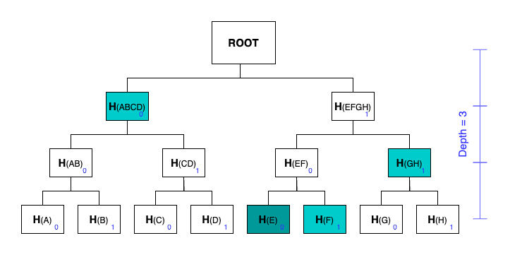

# Merkle for Privacy

_prove that you are a member of a group without revealing your identity_

[The circuit]() uses Merkle Proof as Proof of Membership. Each group is represented by a Merkle root. A member of the group can prove that he is a member of the group by providing a Merkle Proof. I.e. he knows the leaf, the pathIndices and the siblings that lead to the _public_ Merkle root, without revealing the leaf.

```js
template MerkleTreeInclusionProof(nLevels) {
    signal input leaf;
    signal input pathIndices[nLevels];
    signal input siblings[nLevels];

    signal input root;

    component poseidons[nLevels];
    component mux[nLevels];

    signal hashes[nLevels + 1];
    hashes[0] <== leaf;

    for (var i = 0; i < nLevels; i++) {
        pathIndices[i] * (1 - pathIndices[i]) === 0;

        poseidons[i] = Poseidon(2);
        mux[i] = MultiMux1(2);

        mux[i].c[0][0] <== hashes[i];
        mux[i].c[0][1] <== siblings[i];

        mux[i].c[1][0] <== siblings[i];
        mux[i].c[1][1] <== hashes[i];

        mux[i].s <== pathIndices[i];

        poseidons[i].inputs[0] <== mux[i].out[0];
        poseidons[i].inputs[1] <== mux[i].out[1];

        hashes[i + 1] <== poseidons[i].out;
    }

    root === hashes[nLevels];
}
```

## Merkle Trees

- Hash function is Poseidon which is included in circomlib

- `nLevels` is the number of levels in the tree, or the depth of the tree. The number of `leaves = 2^nLevels`

- `leaf` is the hash of the original data

- `pathIndices` is the position of the leaf in the tree, an array with `nLevels` length, each element is either 0 or 1

- `siblings` is the hashes of the nodes on the path from the leaf to the root. The number of `siblings` = `nLevels`

- Given the `leaf`, the `pathIndices` and the `siblings`, the circuit whould be able to compute the root



An example: tree with depth = 3, for leaf H(E), `pathIndices` is [0,0,1] and `siblings` is [H(F), H(GH), H(ABCD)]
