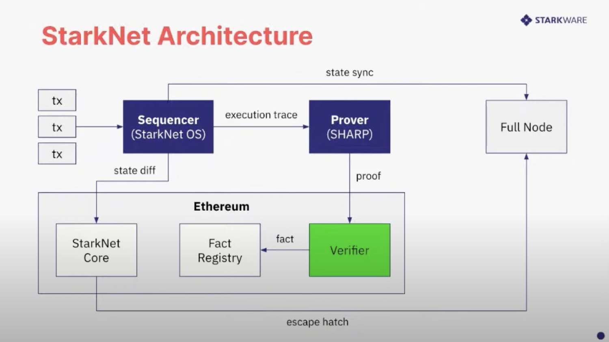

# STARK

Two of the most compelling zero-knowledge technologies in the market today are zk-STARKs and zk-SNARKs. What are the differences between them? The T and the N, `Scalable Transparent` and `Succinct Non-interactive`, respectively.

STARK is mostly utilized by STARKWARE, for app specific rollups STARKEx and recently for StarkNet, a permissionless STARK-based L2 platform.

The importance tradeoffs between STARKs and SNARKs is: STARKs do not require a trusted setup, but the proof size is much larger than SNARKs.


The diagram is taken from Vitalik's [blog post](https://vitalik.ca/general/2019/09/22/plonk.html)

## Starknet architecture

I am curious about how L1 smart contract verifies STARK proofs and wrote on the Starknetbook [Verifiers in Solidity](https://book.starknet.io/chapter_8/solidity_verifier.html) but that's not even scratching the surface. The task is even more daunting when knowing that SHARP (SHARe Prover) aggregates multiple Cairo programs from different users (StarkEx, Starknet, and external users through the Cairo Playground), each containing different logic. These Cairo programs are then executed together, generating a single proof common to all the programs, it is initially sent to a STARK Verifier program written in Cairo, before sending the proof to the Solidity Verifier in Ethereum 🤯



_So is there a way to prove and verify and single Cairo program? Yes._

## Giza

Giza leverages the Winterfell library to prove and verify the execution of programs running on the Cairo VM. I believe that it is being used in [ZeroSync](https://github.com/ZeroSync/ZeroSync), a STARK proof to sync a Bitcoin full node in an instant.

### Running an example

### Cairo VM

Cairo VM is the virtual machine for the Cairo language. The one using here is the Python version [cairo-lang](https://github.com/starkware-libs/cairo-lang). There is breaking change from Cairo0 to Cairo1 and the VM doesn't seem to work with Cairo1 code yet (??? or I'm wrong), so the example will use the Cairo0 code.

```python
%builtins range_check

from starkware.cairo.common.bool import TRUE, FALSE
from starkware.cairo.common.alloc import alloc
from starkware.cairo.common.math import abs_value

func compare_abs_arrays{range_check_ptr: felt}(
    array_a: felt*, array_b: felt*, array_length: felt, iterator: felt
) -> (r: felt) {
    if (iterator == array_length) {
        return (TRUE,);
    }
    let abs_a = abs_value(array_a[iterator]);
    let abs_b = abs_value(array_b[iterator]);
    if (abs_a != abs_b) {
        return (FALSE,);
    }
    return compare_abs_arrays(array_a, array_b, array_length, iterator + 1);
}

func fill_array(array: felt*, base: felt, step: felt, array_length: felt, iterator: felt) {
    if (iterator == array_length) {
        return ();
    }
    assert array[iterator] = base + step * iterator;
    return fill_array(array, base, step, array_length, iterator + 1);
}

func main{range_check_ptr: felt}() {
    alloc_locals;
    tempvar array_length = 10;
    let (array_a: felt*) = alloc();

    let (array_b: felt*) = alloc();
    fill_array(array_a, -7, -3, array_length, 0);
    fill_array(array_b, 7, 3, array_length, 0);
    let result: felt = compare_abs_arrays(array_a, array_b, array_length, 0);
    assert result = TRUE;
    return ();
}

```

- Pseudo code:

  - Generates 2 arrays, `array_a` and `array_b`, with the same length and the same values, but with different signs.

  - Compares the absolute values of the elements of the arrays and returns `TRUE` if they are equal.

  - We want to prove that the execution of the Cairo program was done correctly and the main function returns `TRUE`.

- Install the Cairo VM:

```bash
cd code/stark/cairo-example
python -m venv cairo-vm-venv
source cairo-vm-venv/bin/activate
pip install cairo-lang
```

To make sure that the Cairo VM is installed correctly and we are using the right binary, run `which cairo-compile`. It should return the path to the Cairo VM binary `...cairo-example/cairo-vm-venv/bin/cairo-compile`

- Compile the Cairo program:

```bash
cairo-compile abs_value_array/abs_value_array.cairo --output abs_value_array/abs_value_array.json
```

- Run the program and generate the trace:

```bash
cairo-run --program=abs_value_array/abs_value_array.json --layout=small --memory_file=abs_value_array/memory.bin --trace_file=abs_value_array/trace.bin --print_info

# Valid choices for --layout are: 'plain', 'small', 'dex', 'recursive', 'starknet', 'recursive_large_output', 'all_solidity', 'starknet_with_keccak', 'dynamic'
Number of steps: 623 (originally, 623)
Used memory cells: 663
Register values after execution:
pc = 4:0
ap = 1:510
fp = 3:0
```

- Copy the example files to the Giza directory:

```bash
cp -r abs_value_array ../giza/tmp
```

### Giza

- Install the Giza CLI:

```bash
cd ../giza
cargo install --path cli
```

- Generate the proof:

```bash
giza prove --trace=tmp/abs_value_array/trace.bin --memory=tmp/abs_value_array/memory.bin --program=tmp/abs_value_array/abs_value_array.json --output=tmp/abs_value_array/output.bin

Built domain of 2^12 elements in 0 ms
Evaluated constraints over domain of 2^12 elements in 42 ms
Converted constraint evaluations into 4 composition polynomial columns of degree 1023 in 4 ms
Built DEEP composition polynomial of degree 1023 in 18 ms
Computed 3 FRI layers from composition polynomial evaluations in 169 ms
Determined 54 query positions in 1423 ms
Built proof object in 0 ms
Proof size: 166.0 KB
```

**Proof size: 166.0 KB**

- Verify the proof:

```bash
giza verify --proof=tmp/abs_value_array/output.bin
Execution verified
```
